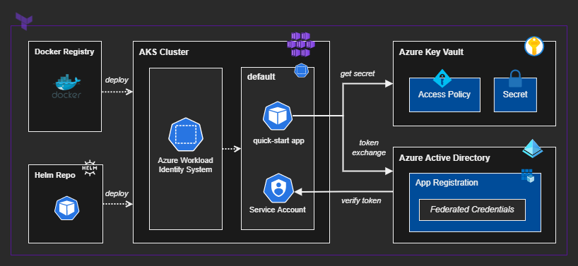

# Azure Workload Identity w/ Terraform

Fully-automated Terraform modules to create an AKS Cluster with active OIDC that integrates with Workload Identity, allowing your pods to connect to Azure resources using Managed Identity, also called pod identity.

ℹ️ This repository is a Terraform implementation of the AWI [quick start](https://azure.github.io/azure-workload-identity/docs/quick-start.html) guideline.

## Architecture

The overall architecture of the solution and it's main components:



## Project Structure

This project is composed by the following Terraform modules:

- **Azure** - Create the RG, AKS cluster w/oidc, KV, App Reg, Service Principal.
- **Helm** - Install the Azure Workload Identity System objects.
- **Kubernetes** - Create the Service Account and deploy a quick-start workload.

ℹ️ Since there are interpolation dependencies for Helm and Kubernetes providers I've created separated modules that allow for isolated `apply` commands, as per Terraform best practices.

## Deployment Steps

### 1 - Enable OIDC Issuer Preview

Head over to this Microsoft Docs section: **[Register the `EnableOIDCIssuerPreview` feature flag](https://docs.microsoft.com/en-us/azure/aks/cluster-configuration#register-the-enableoidcissuerpreview-feature-flag)**

Enable the feature (`az feature register`) and propagate it (`az provider register`).

Then return here and continue. You don't need to install or create anything else as everything will be configured and managed by the Terraform modules.

### 2 - Prepare the local variables

Create the local variables file:

```sh
# Copy from the template
cp .config/example.tfvars .local.tfvars

# Set is as relative to work from the modules root
tfvars='../.local.tfvars'
```

You should change the `app_name` variable. Edit the other variables according to your preferences.


### 3 - Deploy the Resources

Create the Azure Cloud resources:

```bash
terraform -chdir='azure' init
terraform -chdir='azure' apply -var-file=$tfvars -auto-approve
```

Apply the Helm module:

```bash
terraform -chdir='helm' init
terraform -chdir='helm' apply -var-file=$tfvars -auto-approve
```

Apply the Kubernetes module:

```bash
terraform -chdir='kubernetes' init
terraform -chdir='kubernetes' apply -var-file=$tfvars -auto-approve
```

That's it, you can now test it with the `quick-start` container.


## Test the workload

Connect using `kubectl` and check the response:

```bash
az aks get-credentials -g '<resource_group_name>' -n '<ask_cluster_name>'

kubectl logs quick-start
```

You should see `successfully got secret, secret=Hello!`.

---

### Clean Up

Delete the resources to avoid unwanted avoid costs:

```bash
terraform -chdir='azure' destroy -var-file=$tfvars -auto-approve
```
